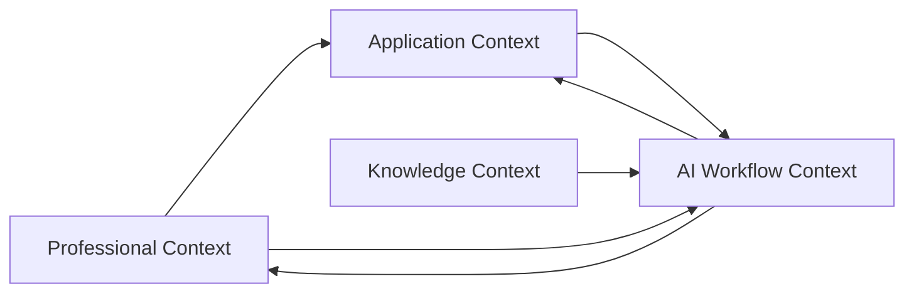
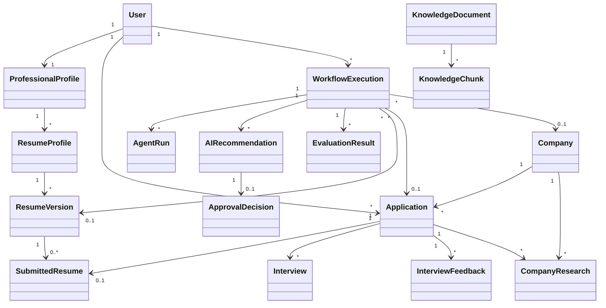
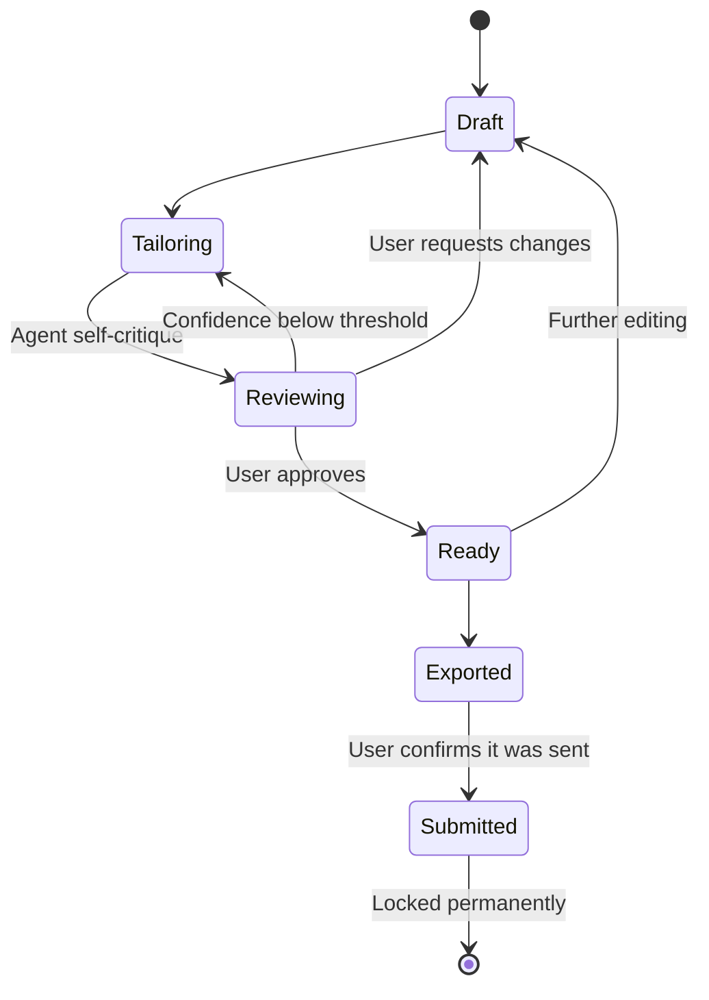
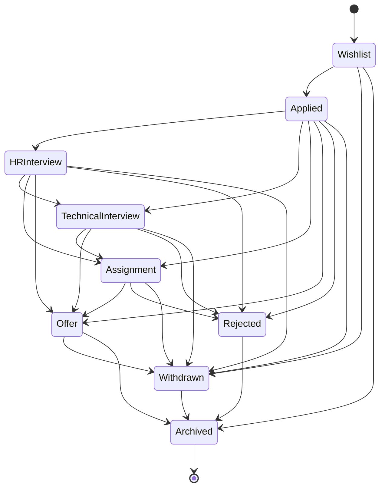
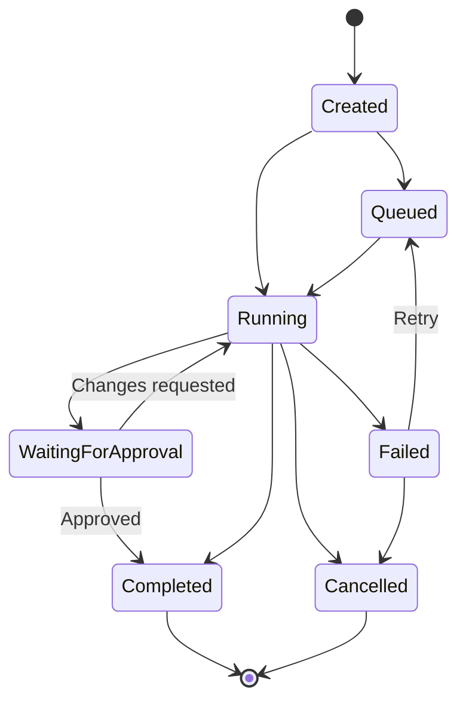
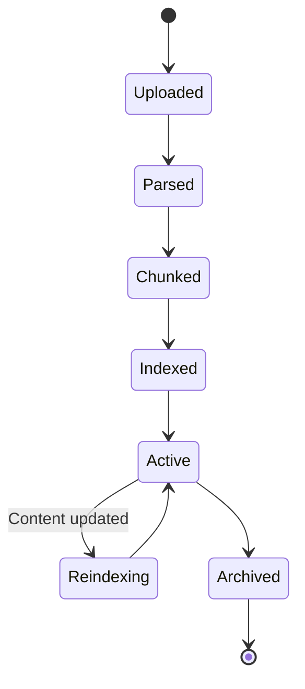

# CareerHQ

### Your AI-powered headquarters for every job application.

---

# Domain Model

**Version:** 1.0  
**Status:** Draft  
**Author:** Nir Tituani  
**Last Updated:** August 2026

---

# 1. Purpose

This document defines the core domain model of CareerHQ.

It describes the bounded contexts, aggregate roots, entities, value objects, relationships, lifecycle rules, domain events, and business invariants that form the foundation of the platform.

The model is intended to guide implementation while remaining independent of specific frameworks, databases, AI providers, and deployment technologies.

This document serves as the domain foundation for:

- System architecture
- Backend module boundaries
- Database schema design
- API design
- AI workflow design
- Application migration from JobTracker

---

# 2. Domain Principles

CareerHQ follows several domain-level principles.

## Professional Knowledge Is the Source of Truth

The user's professional information is stored once in a structured Professional Profile.

Resumes are generated representations of that knowledge rather than independent sources of professional facts.

## Resume Profiles Define Career-Focused Views

A Resume Profile defines how the Professional Profile should be presented for a specific career direction.

Examples include:

- Backend Engineer
- AI Backend Engineer
- Full Stack Engineer

Resume Profiles do not duplicate professional information.

## Tailored Resumes Are Independent Versions

Every tailored Resume Version is created for a specific job opportunity.

Once created, it is independent from future updates to the Professional Profile.

## Submitted Resumes Are Immutable

After a resume is submitted for an Application, the exact exported document is preserved permanently.

## AI Recommends; Users Decide

AI-generated changes are proposals.

AI workflows may analyze, retrieve, rank, rewrite, and recommend, but they may not directly modify user-owned professional data without explicit approval.

## Historical Data Accumulates

Applications, resume versions, interview feedback, research results, and skill-gap analysis contribute to long-term career intelligence.

---

# 3. Bounded Contexts

CareerHQ is divided into four primary bounded contexts.



## Professional Context

Owns the user's structured professional knowledge and resume-related artifacts.

## Application Context

Owns job opportunities, companies, application tracking, statuses, contacts, interviews, and historical submission data.

## AI Workflow Context

Owns AI workflow execution, recommendations, user approvals, model metadata, and workflow state.

## Knowledge Context

Owns curated knowledge, user-specific semantic knowledge, document chunks, embeddings, citations, and retrieval metadata.

---

# 4. Professional Context

## 4.1 Responsibility

The Professional Context manages:

- The user's complete professional profile
- Career-focused Resume Profiles
- Tailored Resume Versions
- Exported and Submitted Resumes
- Resume layout preferences
- Resume section composition
- Resume history

---

## 4.2 Aggregate Root: ProfessionalProfile

### Purpose

`ProfessionalProfile` represents the user's complete and authoritative professional knowledge.

Each user owns exactly one Professional Profile.

### Responsibilities

- Maintain structured professional information
- Preserve user-approved facts
- Support multiple Resume Profiles
- Provide source data for Resume Tailoring
- Provide professional data for Career Advisor analysis
- Preserve separation between facts and AI-generated recommendations

### Owned Information

- Contact information
- Professional titles
- Summary blocks
- Work experience
- Experience bullets
- Skills
- Projects
- Education
- Certifications
- Courses
- Languages
- Military service
- Volunteer experience
- Publications
- Portfolio links

### Business Rules

- A Professional Profile belongs to exactly one user.
- Only user-provided or user-approved information may become part of the Professional Profile.
- AI-generated suggestions must not become profile facts without approval.
- Updating the Professional Profile does not modify existing Resume Versions.
- Updating the Professional Profile does not modify Submitted Resumes.

---

## 4.3 Entity: ResumeProfile

### Purpose

`ResumeProfile` represents a career-oriented view of the Professional Profile.

It defines how professional information should be emphasized for a particular role family or career direction.

Examples:

- Backend Engineer
- AI Backend Engineer
- Cybersecurity Engineer
- Full Stack Engineer

### Responsibilities

- Define the default professional title
- Define preferred summary content
- Define preferred skills and skill ordering
- Define preferred projects
- Define preferred experience highlights
- Define default section ordering
- Define default layout and template preferences
- Provide the starting context for Resume Tailoring

### References

A Resume Profile may reference:

- Summary blocks
- Skills
- Projects
- Experience bullets
- Work experiences
- Certifications
- Courses
- Preferred template
- Layout configuration

### Business Rules

- A Resume Profile belongs to exactly one Professional Profile.
- A Professional Profile may contain multiple Resume Profiles.
- Resume Profiles reference professional facts rather than copy them.
- A Resume Profile may be active or archived.
- Archived Resume Profiles remain visible for historical Resume Versions.
- Updating a Resume Profile does not modify existing Resume Versions.

---

## 4.4 Entity: ResumeVersion

### Purpose

`ResumeVersion` represents a tailored resume created for a specific job opportunity.

It captures the complete approved resume content at a particular point in time.

### Inputs

A Resume Version is created from:

- Professional Profile
- Selected Resume Profile
- Target Job Description
- AI-generated recommendations
- User-approved changes
- Selected resume template
- Layout configuration

### Responsibilities

- Preserve tailored resume content
- Preserve the source Resume Profile
- Preserve the target Job Description reference
- Preserve accepted and rejected recommendations
- Preserve Match Analysis
- Support preview and editing before submission
- Support PDF export
- Preserve generation metadata

### Properties

- Resume Version ID
- Source Resume Profile ID — **lineage**: which Master this was created from
- Source Resume Profile revision — the state of that Master at creation time
- Target Application ID, when available
- Version name
- Professional title
- Structured sections
- Section order
- Item inclusion set — which bullets, skills, and projects are included in this Version
- Layout configuration
- Match Analysis
- Confidence Score from the Reviewer
- Tailoring workflow reference
- Creation timestamp
- Last updated timestamp
- Current lifecycle status
- Export metadata

### Business Rules

- Every Resume Version records exactly one source Resume Profile.
- **Lineage is recorded, not inherited.** After creation a Version is an independent document; it
  never receives updates from its source.
- Resume Versions may be edited while in `Draft` or `Ready`.
- Professional Profile updates do not modify an existing Resume Version.
- Resume Profile updates do not modify an existing Resume Version.
- A Resume Version may produce multiple preview exports.
- A Resume Version may produce only one immutable Submitted Resume per Application submission event.
- A `Submitted` Version is locked: it may be viewed, re-downloaded, or duplicated into a new
  `Draft`, but never modified.
- Item inclusion is per Version. Excluding a bullet from a Version does not remove it from the
  Professional Profile.

---

## 4.5 Entity: SubmittedResume

### Purpose

`SubmittedResume` represents the exact resume document sent to an employer.

It is an immutable historical artifact.

### Properties

- Submitted Resume ID
- Source Resume Version ID
- Application ID
- File reference
- File checksum
- Export format
- Export timestamp
- Submission timestamp
- Template version
- Layout configuration snapshot
- Document metadata

### Business Rules

- A Submitted Resume is immutable.
- A Submitted Resume cannot be edited.
- A Submitted Resume cannot be replaced silently.
- A new submission requires a new Submitted Resume.
- The file checksum must remain stable after submission.
- A Submitted Resume preserves the exact content and layout sent to the employer.

---

## 4.6 Professional Value Objects

### ContactInformation

Contains:

- Full name
- Email
- Phone
- LinkedIn URL
- GitHub URL
- Portfolio URL
- Optional location

### ProfessionalTitle

Contains:

- Display title
- Role family
- Seniority
- Optional specialization

### SummaryBlock

Contains:

- Text
- Supported role families
- Supported seniority levels
- Related skills
- Source
- Approval state

### WorkExperience

Contains:

- Company
- Job title
- Start date
- End date
- Employment type
- Description
- Experience bullets
- Technologies
- Domain tags

### ExperienceBullet

Contains:

- Bullet text
- Related skills
- Related competencies
- Impact indicators
- Quantification
- Source
- Confidence
- Approval state
- Locked state

### Skill

Contains:

- Skill name
- Skill category
- Experience source
- Proficiency level, when provided
- Years of experience, when provided
- Last-used date, when available
- Approved state

### Project

Contains:

- Project name
- Description
- Responsibilities
- Technologies
- Repository URL
- Demo URL
- Start date
- End date
- Project type
- Approved state

### Education

Contains:

- Degree
- Institution
- Field of study
- Start date
- End date
- Optional grade
- Optional specialization

### Certification

Contains:

- Name
- Issuing organization
- Issue date
- Expiration date
- Credential URL

### Language

Contains:

- Language name
- Proficiency level

### ResumeLayout

Contains:

- Template ID
- Font family
- Font size
- Page margins
- Line spacing
- Section spacing
- Heading spacing
- Accent color
- Page size
- Maximum page count

### ResumeSection

Contains:

- Section type
- Section title
- Content references
- Order
- Visibility
- Locked state

### ItemInclusion

Contains:

- Resume Version ID
- Referenced item type — experience bullet, skill, project, certification
- Referenced item ID
- Included state
- Order within its section
- Source — user choice or AI recommendation
- Approval state

Inclusion is resolved **per item, per Version**. A Resume Version does not copy professional
content; it records which items from the Professional Profile it includes and in what order. This
is what allows a user to approve or reject an AI proposal one bullet at a time, and what makes a
Version a lightweight selection rather than a duplicated document.

---

# 5. Application Context

## 5.1 Responsibility

The Application Context manages the complete lifecycle of job opportunities and applications.

It preserves and extends the existing JobTracker capabilities while adding submitted-resume history, company research, interviews, and AI analysis.

The Application Context manages:

- Companies
- Job opportunities
- Job descriptions
- Application statuses
- Submission details
- Application sources
- Contacts
- Salary information
- Notes
- Interviews
- Feedback
- Submitted resumes
- Match analysis
- Status history
- Application analytics

---

## 5.2 Aggregate Root: Application

### Purpose

`Application` represents one tracked employment opportunity.

An Application may be created before a resume is submitted.

This supports wishlist and preparation workflows.

### Responsibilities

- Track one job opportunity
- Preserve job and company information
- Track current application status
- Preserve status history
- Link the exact Submitted Resume
- Store contacts and submission source
- Store notes and feedback
- Link company research
- Provide historical data for Career Advisor analysis
- Support application analytics

### Properties

- Application ID
- User ID
- Company ID
- Job title
- Location
- Job description
- Job URL
- Job description URL
- Company careers URL
- Date added
- Date applied
- Current status
- Normalized status category
- Status history
- Salary range
- Application source
- Contact information
- Match Analysis
- Notes
- Submitted Resume ID
- Created timestamp
- Last updated timestamp
- Archived state

### Business Rules

- Every Application belongs to exactly one user.
- Every Application belongs to exactly one Company.
- An Application may exist without a Submitted Resume while in `Wishlist`.
- An Application in `Applied` or any later stage must reference a Submitted Resume.
- An Application may not reference an editable Resume Version as the submitted document.
- Every status change must be recorded.
- User-configured status labels must map to normalized analytics categories.
- Application history must remain available after rejection, withdrawal, or archiving.

---

## 5.3 Entity: Company

### Purpose

`Company` represents an organization associated with one or more job opportunities.

### Responsibilities

- Preserve company identity
- Avoid duplicate company records
- Support multiple Applications
- Store user notes
- Store company domain and careers links
- Link Company Research snapshots

### Properties

- Company ID
- Name
- Domain
- Website URL
- Careers URL
- Industry
- Location
- Logo reference
- User notes
- Created timestamp
- Last updated timestamp

### Business Rules

- One Company may be associated with multiple Applications.
- Company research results do not overwrite historical research snapshots.
- Companies may be merged when duplicate records are identified.

---

## 5.4 Entity: Interview

### Purpose

`Interview` represents one interview event or hiring-process stage.

### Properties

- Interview ID
- Application ID
- Interview type
- Scheduled time
- Duration
- Interviewer information
- Meeting URL
- Preparation notes
- Completion state
- Created timestamp

### Interview Types

- Recruiter Call
- HR Interview
- Hiring Manager Interview
- Technical Interview
- System Design Interview
- Coding Interview
- Assignment Review
- Final Interview
- Other

### Business Rules

- An Interview belongs to exactly one Application.
- An Interview may exist before feedback is provided.
- Completing an Interview may create an Interview Feedback record.

---

## 5.5 Entity: InterviewFeedback

### Purpose

`InterviewFeedback` stores the user's reflections and feedback from an interview stage.

### Properties

- Feedback ID
- Application ID
- Interview ID, when applicable
- Feedback source
- Notes
- Questions asked
- Topics covered
- Strengths
- Weaknesses
- Skill gaps
- Outcome
- Created timestamp

### Business Rules

- Interview Feedback belongs to exactly one Application.
- Feedback may be attached to an Interview.
- Feedback may contribute to Career Advisor insights.
- AI-derived insights from feedback must remain distinguishable from user-provided feedback.

---

## 5.6 Entity: CompanyResearch

### Purpose

`CompanyResearch` represents one on-demand research snapshot.

Research is generated only when requested by the user.

### Properties

- Research ID
- Company ID
- Application ID, when application-specific
- Company overview
- Product summary
- Industry summary
- Technology information
- Basic interview briefing
- Sources
- Generation timestamp
- Workflow Execution ID

### Business Rules

- Research must be generated on explicit user request.
- Research must preserve its sources.
- Historical research is not overwritten.
- New research creates a new snapshot.
- Time-sensitive facts should include retrieval timestamps.

---

## 5.7 Application Value Objects

### JobDescription

Contains:

- Original text
- Source URL
- Job title
- Responsibilities
- Required qualifications
- Preferred qualifications
- Technologies
- Education requirements
- Seniority
- Domain
- Location
- Employment type
- Extraction timestamp

### ApplicationStatus

Contains:

- Display label
- Normalized category
- Color
- Sort order
- Terminal-state indicator

### Normalized Application Statuses

- Wishlist
- Applied
- HR Interview
- Technical Interview
- Assignment
- Offer
- Rejected
- Withdrawn

### StatusHistoryEntry

Contains:

- Previous status
- New status
- Changed timestamp
- Optional note
- Changed by

### ApplicationSource

Examples:

- Company Website
- LinkedIn
- Recruiter
- Referral
- Job Board
- Internal Connection
- Other

User-configured values are supported.

### ContactDetails

Contains:

- Contact name
- Contact email
- Contact role
- LinkedIn URL
- Optional notes

### SalaryRange

Contains:

- Minimum value
- Maximum value
- Currency
- Compensation period
- Optional equity notes

### JobLinks

Contains:

- Job posting URL
- Job-description URL
- Company careers URL

### ApplicationNote

Contains:

- Note text
- Creation timestamp
- Last updated timestamp
- Optional category

### MatchAnalysis

Contains:

- Overall score
- Skills score
- Experience score
- Education score
- Domain score
- Seniority score
- Identified strengths
- Missing must-have requirements
- Missing preferred requirements
- Borderline requirements
- Explanation
- Analysis timestamp
- Model metadata

---

# 6. AI Workflow Context

## 6.1 Responsibility

The AI Workflow Context manages AI-assisted workflows without granting AI direct ownership over business data.

It manages:

- Workflow execution
- Agent execution
- Tool calls
- Recommendations
- Resume diffs
- User approval
- Short-term workflow state
- Model metadata
- Cost and token usage
- Errors and retries
- Evaluation results
- Audit history

---

## 6.2 Aggregate Root: WorkflowExecution

### Purpose

`WorkflowExecution` represents one complete AI-assisted business workflow.

Examples:

- Resume Tailoring
- Resume Review
- Company Research
- Career Advisor Analysis
- Knowledge Ingestion
- Evaluation Run

### Responsibilities

- Preserve workflow type
- Preserve current workflow state
- Coordinate Agent Runs
- Store intermediate and final results
- Pause for human approval
- Record errors and retries
- Record model and prompt configuration
- Preserve auditability

### Properties

- Workflow Execution ID
- User ID
- Workflow type
- Related Application ID
- Related Resume Version ID
- Related Company ID
- Current status
- Current step
- Input snapshot
- Output snapshot
- Creation timestamp
- Start timestamp
- Completion timestamp
- Error metadata
- Retry count

### Workflow Statuses

- Created
- Queued
- Running
- Waiting for Approval
- Completed
- Failed
- Cancelled

### Business Rules

- Every AI workflow belongs to exactly one user.
- Every Workflow Execution must preserve its inputs.
- Every Workflow Execution must preserve its model configuration.
- Waiting workflows must not continue without the required user decision.
- Failed workflows may be retried according to workflow policy.
- Completed workflows remain available for audit and evaluation.

---

## 6.3 Entity: AgentRun

### Purpose

`AgentRun` represents one specialized Agent execution within a Workflow Execution.

Examples:

- Job Analysis Agent
- Resume Tailoring Agent
- Resume Reviewer Agent
- Company Research Agent
- Career Advisor Agent
- Evaluation Agent

### Properties

- Agent Run ID
- Workflow Execution ID
- Agent type
- Input
- Output
- Start timestamp
- Completion timestamp
- Model configuration
- Tool calls
- Token usage
- Cost estimate
- Status
- Error details

### Business Rules

- An Agent Run belongs to exactly one Workflow Execution.
- An Agent Run may invoke multiple Tools.
- Every Agent Run must return structured output.
- Agent Runs may not directly modify Professional or Application aggregates.

---

## 6.4 Entity: AIRecommendation

### Purpose

`AIRecommendation` represents one proposed change, insight, or action.

Examples:

- Rewrite summary
- Reorder skills
- Replace an experience bullet
- Highlight a project
- Identify a missing requirement
- Recommend a learning priority

### Properties

- Recommendation ID
- Workflow Execution ID
- Agent Run ID
- Recommendation type
- Target entity
- Target field or section
- Original value
- Proposed value
- Reason
- Supporting evidence
- Confidence
- Approval state
- Creation timestamp

### Business Rules

- Every Recommendation belongs to exactly one Workflow Execution.
- Every Recommendation must include an explanation.
- Resume recommendations must include a structured diff.
- Unsupported professional claims must be rejected.
- Recommendations remain reversible until submission.
- Recommendations cannot apply themselves.

---

## 6.5 Entity: ApprovalDecision

### Purpose

`ApprovalDecision` records the user's response to an AI Recommendation.

### Properties

- Decision ID
- Recommendation ID
- User ID
- Decision
- Optional edited value
- Optional user note
- Decision timestamp

### Decision Types

- Approved
- Rejected
- Edited and Approved
- Deferred

### Business Rules

- One Recommendation may have one final Approval Decision.
- Approved changes may be applied by the relevant domain service.
- Rejected changes must not alter user-owned data.
- Edited recommendations preserve both original and final values.

---

## 6.6 Entity: EvaluationResult

### Purpose

`EvaluationResult` records the measured quality of an Agent Run or Workflow Execution.

### Properties

- Evaluation Result ID
- Workflow Execution ID
- Agent Run ID, when applicable
- Evaluation type
- Dataset reference
- Metrics
- Score
- Evaluator type
- Notes
- Creation timestamp

### Evaluation Types

- Human Evaluation
- Rule-Based Evaluation
- LLM-as-Judge
- Regression Evaluation
- RAG Retrieval Evaluation
- Resume Integrity Evaluation

---

## 6.7 AI Value Objects

### ResumeDiff

Contains:

- Target section
- Original content
- Proposed content
- Added content
- Removed content
- Change reason
- Supporting Job Requirement
- Confidence

### MatchScore

Contains:

- Overall score
- Component scores
- Score explanation
- Missing requirements
- Strengths
- Confidence

### ToolCall

Contains:

- Tool name
- Tool input
- Tool output
- Execution timestamp
- Duration
- Success state
- Error

### ModelConfiguration

Contains:

- Provider
- Model
- Temperature
- Maximum tokens
- Prompt version
- Structured-output schema version

### TokenUsage

Contains:

- Input tokens
- Output tokens
- Cached tokens
- Total tokens

### CostEstimate

Contains:

- Input cost
- Output cost
- Total cost
- Currency

### ErrorDetails

Contains:

- Error type
- Error message
- Retryable state
- Retry count
- Last attempt timestamp

### WorkflowState

Contains temporary execution information such as:

- Current step
- Extracted job requirements
- Retrieved knowledge
- Proposed changes
- Review results
- Approval state
- Tool outputs
- Partial results

Workflow State is short-term execution memory and is not automatically promoted to long-term user memory.

---

# 7. Knowledge Context

## 7.1 Responsibility

The Knowledge Context manages retrievable information used to ground AI workflows.

It separates:

- Structured operational facts
- Semantic user knowledge
- Curated general knowledge
- Research documents
- Embeddings
- Citations
- Retrieval metadata

---

## 7.2 Aggregate Root: KnowledgeDocument

### Purpose

`KnowledgeDocument` represents one source that may be indexed for semantic retrieval.

### Knowledge Source Types

- Resume Best Practices
- ATS Guidelines
- Domain-Specific Resume Guidelines
- Seniority Guidelines
- Integrity and Guardrail Policies
- User Professional Profile
- Historical Job Descriptions
- Interview Feedback
- Stored Company Research
- Learning Resources
- Evaluation Examples

### Properties

- Knowledge Document ID
- Owner type
- Owner ID
- Source type
- Title
- Original content
- File reference
- Source URL
- Trust level
- Version
- Active state
- Creation timestamp
- Last updated timestamp

### Business Rules

- User-owned documents must be isolated by user.
- Curated general knowledge may be shared across users.
- Archived documents are excluded from retrieval by default.
- Source metadata must be preserved.
- Updated documents require re-indexing.

---

## 7.3 Entity: KnowledgeChunk

### Purpose

`KnowledgeChunk` represents one retrievable segment of a Knowledge Document.

### Properties

- Chunk ID
- Knowledge Document ID
- Chunk content
- Chunk order
- Token count
- Metadata
- Embedding
- Creation timestamp

### Business Rules

- Every Chunk belongs to exactly one Knowledge Document.
- Chunk order must preserve original document sequence.
- Every embedded Chunk must preserve source metadata.
- Chunks may be regenerated when the chunking strategy changes.

---

## 7.4 Knowledge Value Objects

### ChunkMetadata

May contain:

- Topic
- Role family
- Seniority
- Resume section type
- Source title
- Source URL
- Publication date
- Retrieval date
- Trust level
- User ID
- Company ID
- Application ID
- Document version
- Language

### Citation

Contains:

- Source title
- Source URL
- Document ID
- Chunk ID
- Relevant text
- Retrieval timestamp

### RetrievalResult

Contains:

- Chunk
- Similarity score
- Reranking score
- Metadata
- Citation

### TrustLevel

Supported initial values:

- High
- Medium
- Low
- Internal Policy
- User-Provided

---

## 7.5 Retrieval Rules

Structured facts must be retrieved using relational queries.

Examples:

- Application status
- Submission date
- User skills
- Resume Version ownership
- Interview count
- Match Score history

Semantic or textual knowledge may be retrieved using vector search.

Examples:

- Resume guidelines
- Similar experience bullets
- Historical job requirements
- Interview feedback themes
- Relevant company research
- Domain-specific writing guidance

```text
Structured Facts → Relational Query

Semantic Knowledge → Vector Retrieval

External Current Facts → Web Search
```

---

# 8. Cross-Context Relationships



---

# 9. Aggregate Boundaries

## Professional Aggregate

```text
ProfessionalProfile
│
├── Contact Information
├── Summary Blocks
├── Work Experiences
│   └── Experience Bullets
├── Skills
├── Projects
├── Education
├── Certifications
├── Courses
├── Languages
└── Resume Profiles
```

`ResumeVersion` references the originating Resume Profile but is persisted as an independent snapshot.

`SubmittedResume` is a separate immutable artifact.

## Application Aggregate

```text
Application
│
├── Job Description
├── Application Status
├── Status History
├── Contact Details
├── Salary Range
├── Job Links
├── Notes
├── Interviews
└── Interview Feedback
```

The Application references:

- Company
- Submitted Resume
- Company Research snapshots
- Match Analysis

## AI Workflow Aggregate

```text
WorkflowExecution
│
├── Workflow State
├── Agent Runs
├── AI Recommendations
├── Approval Decisions
└── Evaluation Results
```

## Knowledge Aggregate

```text
KnowledgeDocument
│
└── Knowledge Chunks
    ├── Metadata
    ├── Embedding
    └── Citation Data
```

---

# 10. Entity Lifecycles

## 10.1 Resume Version Lifecycle



### Rules

- `Draft` and `Tailoring` are editable.
- `Reviewing` is the Reviewer agent's grounding, integrity, and coverage check. It may loop back to
  `Tailoring` on its own initiative when the Confidence Score is below threshold — this loop is
  internal and does not require user input.
- `Ready` means user-approved. It remains editable; approval is not a one-way door until export.
- Export does not imply submission. A user may export a PDF and never send it.
- `Submitted` is terminal and **locked**. The Version cannot be edited again. Duplicating it
  creates a new `Draft` with its own lineage.
- A Version's source Resume Profile may change at any time without affecting the Version.

---

## 10.2 Application Lifecycle



### Rules

- Custom display statuses are allowed.
- Analytics use normalized status categories.
- Status history is append-only.
- Moving to `Applied` requires a Submitted Resume.

---

## 10.3 Workflow Execution Lifecycle



---

## 10.4 Knowledge Document Lifecycle



---

# 11. Domain Events

Domain events describe meaningful business changes.

They do not require an external event broker in the MVP.

They may initially be handled within the Modular Monolith.

## Professional Context Events

- ProfessionalProfileCreated
- ProfessionalProfileUpdated
- ProfessionalFactApproved
- ResumeProfileCreated
- ResumeProfileUpdated
- ResumeProfileArchived
- ResumeTailoringStarted
- ResumeVersionCreated
- ResumeVersionUpdated
- ResumeVersionApproved
- ResumeExported
- ResumeSubmitted

## Application Context Events

- CompanyCreated
- CompanyUpdated
- ApplicationCreated
- ApplicationUpdated
- ApplicationStatusChanged
- SubmittedResumeLinked
- InterviewScheduled
- InterviewCompleted
- InterviewFeedbackAdded
- CompanyResearchRequested
- CompanyResearchCompleted
- ApplicationArchived

## AI Workflow Context Events

- WorkflowCreated
- WorkflowQueued
- WorkflowStarted
- AgentRunStarted
- AgentRunCompleted
- ToolCallCompleted
- RecommendationGenerated
- RecommendationApproved
- RecommendationRejected
- WorkflowWaitingForApproval
- WorkflowCompleted
- WorkflowFailed
- EvaluationCompleted

## Knowledge Context Events

- KnowledgeDocumentAdded
- KnowledgeDocumentUpdated
- KnowledgeDocumentParsed
- KnowledgeChunksCreated
- EmbeddingsGenerated
- KnowledgeDocumentIndexed
- KnowledgeDocumentArchived

---

# 12. Domain Invariants

## 12.1 Professional Context Invariants

- Each user owns exactly one Professional Profile.
- Every Resume Profile belongs to one Professional Profile.
- Every Resume Version records exactly one source Resume Profile, and that lineage is immutable.
- A Resume Version never inherits changes from its source after creation.
- A Submitted Resume Version can never transition to any other state.
- Imported resume content becomes a professional fact only after explicit user review.
- Professional facts must originate from the user or receive explicit user approval.
- AI suggestions are not professional facts.
- Submitted Resumes are immutable.
- Existing Resume Versions are not modified by later profile updates.
- Existing Submitted Resumes are not modified by later profile updates.
- A Resume Version must preserve its source Job Description and Resume Profile references.
- Locked resume content may not be changed by AI.

## 12.2 Application Context Invariants

- Every Application belongs to one user.
- Every Application belongs to one Company.
- Wishlist Applications may exist without a Submitted Resume.
- Applied Applications must reference a Submitted Resume.
- Applications may not reference editable Resume Versions as submitted documents.
- Status history is append-only.
- User-configured statuses must map to normalized analytics categories.
- Archived Applications remain available for historical analytics.
- Company Research snapshots are immutable after generation.
- Interview Feedback must remain distinguishable from AI-derived interpretations.

## 12.3 AI Workflow Context Invariants

- Every Workflow Execution belongs to one user.
- Every Agent Run belongs to one Workflow Execution.
- Every Recommendation belongs to one Workflow Execution.
- Every Recommendation must include an explanation.
- Every resume modification must be reversible before submission.
- Resume changes require explicit user approval.
- Agents may not directly modify Professional or Application aggregates.
- Every Workflow Execution must preserve model and prompt metadata.
- Every Tool Call must be auditable.
- Failed workflows must preserve their failure information.
- User rejection must prevent the proposed change from being applied.

## 12.4 Knowledge Context Invariants

- Every Knowledge Chunk belongs to one Knowledge Document.
- Every Embedding belongs to one Knowledge Chunk.
- User-specific knowledge must remain isolated by user.
- Curated general knowledge must preserve source and trust metadata.
- Archived knowledge is excluded from retrieval by default.
- Retrieved knowledge must preserve citation data.
- Structured operational facts must not rely exclusively on semantic retrieval.
- Current external facts must not rely exclusively on stale stored research.

---

# 13. Domain Services

Some operations span multiple entities or contexts and do not naturally belong to a single entity.

## ResumeTailoringService

Coordinates:

- Job Description analysis
- Professional knowledge retrieval
- Resume Profile preferences
- AI recommendations
- Resume diff creation
- User approval
- Resume Version creation

## ResumeSubmissionService

Coordinates:

- Resume Version validation
- PDF export
- File checksum creation
- Submitted Resume creation
- Application linking

## ApplicationLifecycleService

Coordinates:

- Status transitions
- Status history
- Submitted Resume requirements
- Analytics normalization

## CompanyResearchService

Coordinates:

- Web research
- Source collection
- AI summarization
- Citation preservation
- Research snapshot creation

## CareerInsightService

Coordinates:

- Application-history analysis
- Match-analysis aggregation
- Interview-feedback analysis
- Recurring Skill Gap detection
- Learning-priority recommendations

## KnowledgeIngestionService

Coordinates:

- Document parsing
- Chunking
- Metadata creation
- Embedding generation
- Indexing

## RecommendationApprovalService

Coordinates:

- Recommendation review
- Approval or rejection
- Manual edits
- Application of approved changes through domain services
- Audit recording

---

# 14. Current JobTracker Capability Mapping

CareerHQ preserves or extends the following capabilities from the existing JobTracker.

| Existing Capability | CareerHQ Domain Representation |
|---|---|
| Application CRUD | Application Aggregate |
| Search and filtering | Application Query Layer |
| Custom statuses and colors | ApplicationStatus |
| Applied Via options | ApplicationSource |
| Application notes | ApplicationNote |
| Date applied | Application property |
| Job and description links | JobLinks |
| Salary range | SalaryRange |
| Contact person and email | ContactDetails |
| Match rating | MatchAnalysis |
| Rejected state | Normalized ApplicationStatus |
| Company domain | Company |
| Dashboard statistics | Application Analytics |
| CSV export | Data Portability capability |
| Data import | Import Service |
| Authentication | User boundary |
| User-specific data | Ownership invariant |

The existing `rejected` Boolean should not remain an independent source of truth.

Rejection should be derived from the normalized Application Status to avoid inconsistent states.

---

# 15. Key Design Decisions

## Professional Profile Is the System of Record

Professional information is stored once and reused across Resume Profiles and future workflows.

## Resume Profiles Are Career-Focused Views

Resume Profiles define preferences and emphasis without duplicating professional knowledge.

## Resume Versions Are Point-in-Time Snapshots

Every job-specific resume preserves the exact content created for that opportunity.

## Submitted Resumes Are Immutable Artifacts

Application history must always preserve the exact document that was sent.

## Applications May Begin Before Submission

A user may create a Wishlist Application before tailoring or submitting a resume.

## AI Does Not Own Business Data

AI produces structured Recommendations.

Domain Services apply only user-approved changes.

## Operational and Semantic Data Remain Distinct

Structured business facts are retrieved relationally.

Meaning-based retrieval uses the Knowledge Context.

## Company Research Is Snapshot-Based

Research is generated on demand and saved as a time-stamped snapshot with sources.

## Application Statuses Support Customization

Users may configure display labels and colors, while normalized categories preserve consistent analytics.

---

# 16. Open Questions

The following questions do not block MVP development.

## OQ-001: Multiple Submitted Documents

Should one Application support multiple submitted resumes when a user reapplies or sends an updated document?

**MVP Decision:** One active Submitted Resume per Application. Historical replacements may be introduced later.

## OQ-002: Shared Company Research

Should Company Research be shared between all Applications for the same Company?

**MVP Decision:** Preserve Company-level research while allowing Application-specific snapshots.

## OQ-003: Archived Resume Profiles

Should archived Resume Profiles be selectable for new tailoring workflows?

**MVP Decision:** No. Archived profiles remain available only for historical views.

## OQ-004: Custom Application Status Mapping

How should user-defined statuses map to normalized analytics categories?

**MVP Decision:** Each custom status must reference one normalized category.

## OQ-005: Resume Version Reuse

Should a user be able to reuse an existing Resume Version for another Application?

**MVP Decision:** The user may duplicate an existing Resume Version, but each Application submission receives a distinct Submitted Resume snapshot.

---

# 17. Future Evolution

The domain model may later expand to include:

- Cover Letter entities
- Application Packages
- Interview Preparation Plans
- Learning Plans
- Networking Contacts
- Recruiter Profiles
- Career Consultant collaboration
- Multiple Professional Profiles
- Shared organization accounts
- Multiple Submitted Documents per Application
- Email and calendar synchronization
- Automated status detection
- Job-posting ingestion
- Salary negotiation workflows
- Portfolio generation

Future capabilities should preserve the current principles:

- Professional knowledge remains user-owned.
- AI remains explainable.
- Historical application artifacts remain reproducible.
- User approval remains required for professional-content changes.
- Bounded contexts remain independently evolvable.