# CareerHQ

> **System Design & Architecture**

**Version:** 1.0  
**Status:** Draft

---

# 1. Executive Summary

CareerHQ is an AI-native career platform designed around intelligent workflows rather than isolated AI features.

Business domains remain deterministic and own all business data.

Artificial Intelligence operates through a dedicated Agent Runtime that retrieves knowledge, executes specialized agents and produces structured recommendations.

Every workflow follows the same lifecycle:

1. Receive business goal
2. Retrieve contextual knowledge
3. Execute AI workflow
4. Generate recommendations
5. Request user approval
6. Persist validated business changes

---

# 2. Architecture Goals

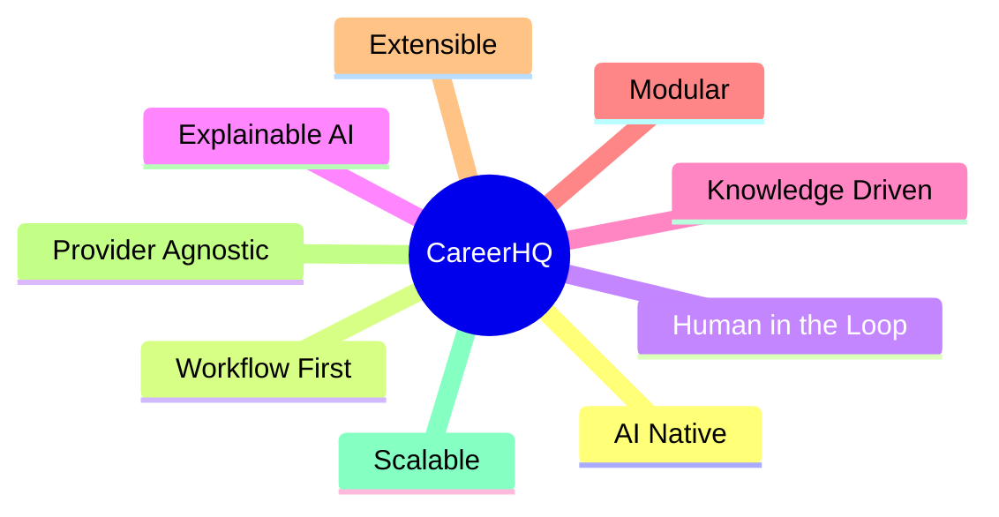

---

# 3. Quality Attributes

| Attribute | Priority | Response |
|-----------|----------|----------|
| Maintainability | High | Layered Architecture |
| Extensibility | High | Platform Services |
| Explainability | High | Structured Outputs |
| Reliability | High | Human Approval |
| Security | High | OAuth + User Isolation |
| Scalability | Medium | Stateless APIs |
| Performance | Medium | Async Workers |
| Cost | High | AI Gateway |

---

# 4. Architecture Principles

## Business Domains Own Data

Business entities belong exclusively to Business Domains.

AI never modifies business entities directly.

---

## Workflow First

Users initiate workflows.

Agents execute workflow steps.

Users never invoke agents directly.

---

## AI Is A Platform Capability

Artificial Intelligence is implemented through reusable platform services.

Business logic never depends on model providers.

---

## Knowledge Before Generation

Knowledge is retrieved before every generation task whenever factual information is required.

---

## Human In The Loop

Business changes require explicit approval before persistence.

---

## Technology Independence

Architecture describes responsibilities.

Technology implements responsibilities.

---

# 5. Responsibility Map

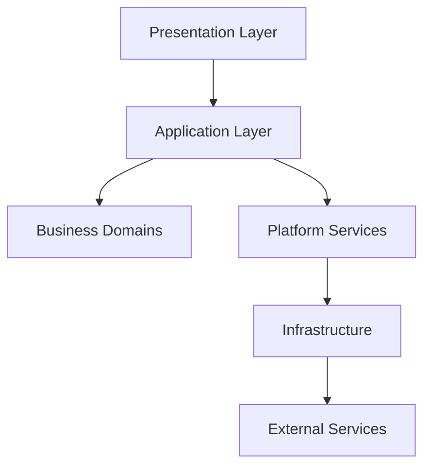

| Layer | Responsibility |
|--------|----------------|
| Presentation | User Experience |
| Application | Use Cases |
| Domain | Business Rules |
| Platform | AI Execution |
| Infrastructure | Technical Services |
| External | Third-party Integrations |

---

# 6. C4 - System Context

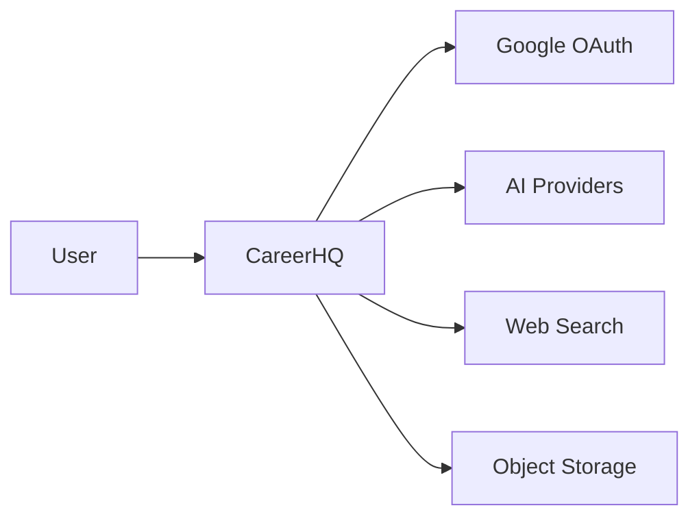

---

# 7. C4 - Container Diagram

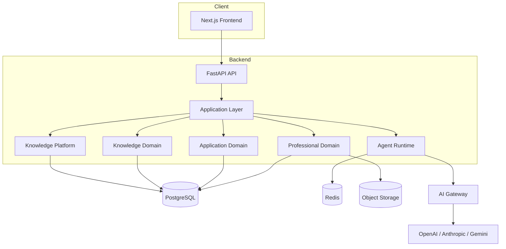

---

# 8. Layered Architecture

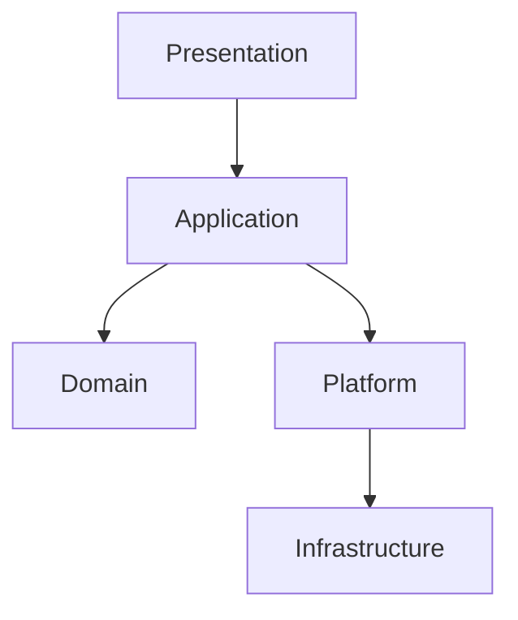

## Presentation Layer

Responsibilities:

- User Interface
- Authentication
- Forms
- Dashboard
- Resume Editor

---

## Application Layer

Responsibilities:

- Execute Use Cases
- Coordinate Domains
- Invoke Platform Services
- Handle Transactions
- Manage Approval Flow

---

## Domain Layer

Responsibilities:

- Business Rules
- Validation
- Aggregate Management
- Repository Coordination

Domains:

- Professional
- Application
- Knowledge

---

## Platform Layer

Responsibilities:

- AI Execution
- Knowledge Retrieval

Contains:

- Agent Runtime
- Knowledge Platform

---

## Infrastructure

Responsibilities:

- Database
- Redis
- Storage
- Workers
- Logging
- Configuration

# 9. Backend Component Architecture

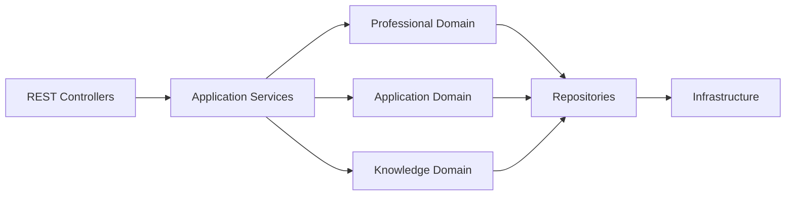

## Purpose

The backend follows Clean Architecture principles.

Each layer has a single responsibility.

Business rules are isolated from infrastructure and AI execution.

---

## Responsibilities

### REST Controllers

- Validate HTTP requests
- Authenticate users
- Convert DTOs
- Return HTTP responses

Controllers never contain business logic.

---

### Application Services

Responsible for orchestrating business use cases.

Examples:

- Tailor Resume
- Submit Application
- Research Company
- Prepare Interview

Application Services coordinate domains and platform services.

---

### Business Domains

Business Domains enforce deterministic rules.

Current domains:

- Professional Domain
- Application Domain
- Knowledge Domain

Business Domains never call AI providers.

---

### Repositories

Repositories abstract persistence.

Responsibilities:

- Load Aggregates
- Save Aggregates
- Query Read Models

Repositories never contain business logic.

---

# 10. Agent Runtime

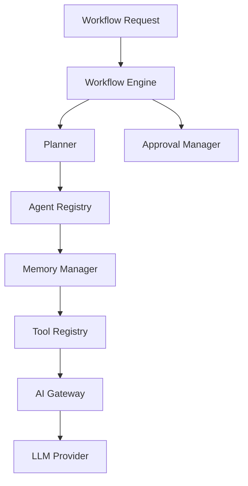

## Purpose

The Agent Runtime is responsible for executing every intelligent workflow inside CareerHQ.

It provides AI capabilities without owning business entities.

Business Domains remain deterministic.

---

## Responsibilities

- Execute workflows
- Coordinate agents
- Manage workflow state
- Invoke tools
- Retrieve knowledge
- Route AI requests
- Pause for approval
- Resume execution
- Record execution metadata

---

## Runtime Boundaries

The Agent Runtime **owns**:

- Workflow execution
- Planning
- Tool invocation
- AI communication
- Temporary memory

The Agent Runtime **does not own**:

- Professional Profiles
- Applications
- Resume Versions
- Company Research
- Business validation

---

# 11. Workflow Engine

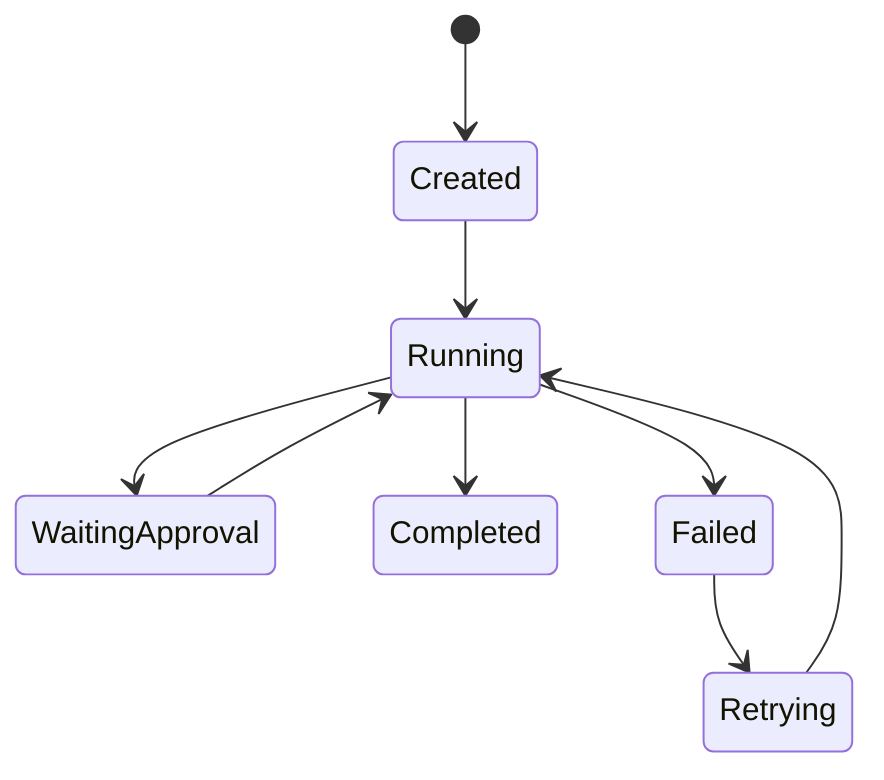

## Responsibilities

- Start workflows
- Execute workflow graph
- Persist execution state
- Retry failed steps
- Resume paused execution
- Publish workflow events

The Workflow Engine is independent of any specific orchestration framework.

Current implementation:

- LangGraph

---

# 12. Planner

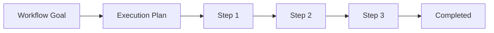

## Purpose

The Planner converts business goals into executable workflow steps.

Current implementation:

Deterministic planning.

Future implementation:

Dynamic planning based on workflow context.

---

## Example

Resume Tailoring

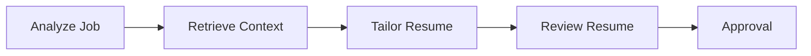

---

# 13. Agent Registry

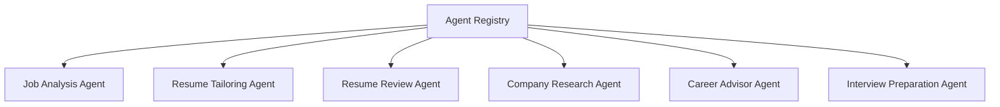

## Purpose

The Agent Registry maintains all available AI agents.

Agents are stateless execution units.

Each agent declares:

- Input Schema
- Output Schema
- Supported Models
- Required Tools
- Configuration

---

# 14. Tool Registry

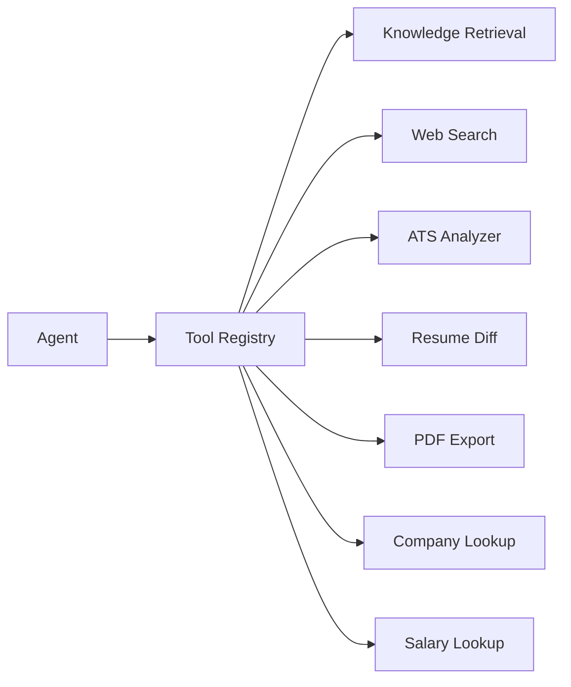

## Purpose

The Tool Registry exposes reusable capabilities.

Agents invoke tools through a common interface.

Tools may interact with:

- Knowledge Platform
- Infrastructure
- External Providers

Agents never communicate directly with external systems.

---

# 15. AI Gateway

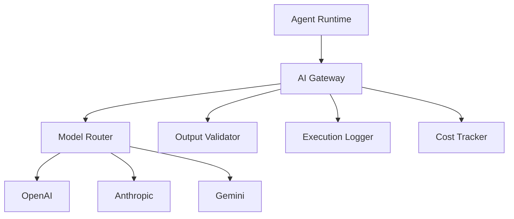

## Purpose

The AI Gateway provides a single integration point for all language models.

Business code remains completely independent from AI providers.

---

## Responsibilities

- Provider Routing
- Model Selection
- Retry Strategy
- Rate Limiting
- Cost Tracking
- Structured Output Validation
- Request Logging
- Response Normalization

---

## Design Decisions

- Business logic never communicates directly with model providers.
- Model providers are replaceable.
- Every AI response is validated before returning to the Agent Runtime.
- All AI requests are observable and auditable.

---