# CareerHQ

> **System Design & Architecture**

**Version:** 1.0  
**Status:** Draft

---

# 1. Executive Summary

CareerHQ is an AI-native career platform designed around intelligent workflows rather than isolated AI features.

Business domains remain deterministic and own all business data.

Artificial Intelligence operates through a dedicated Agent Runtime that retrieves knowledge, executes specialized agents and produces structured recommendations.

Every workflow follows the same lifecycle:

1. Receive business goal
2. Retrieve contextual knowledge
3. Execute AI workflow
4. Generate recommendations
5. Request user approval
6. Persist validated business changes

---

# 2. Architecture Goals

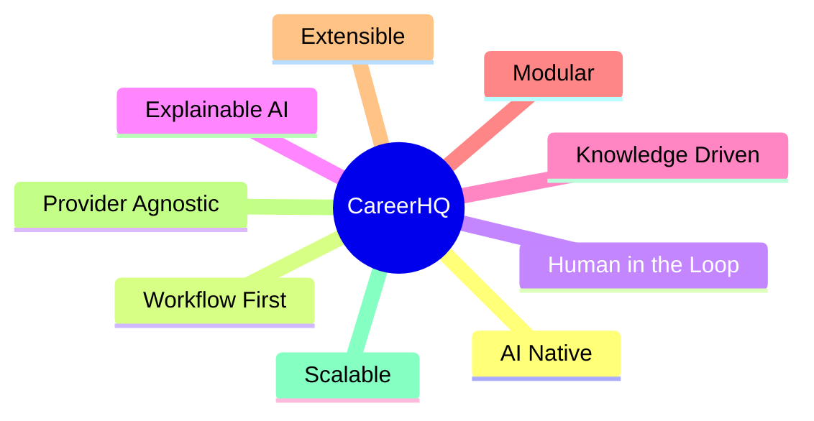

---

# 3. Quality Attributes

| Attribute | Priority | Response |
|-----------|----------|----------|
| Maintainability | High | Layered Architecture |
| Extensibility | High | Platform Services |
| Explainability | High | Structured Outputs |
| Reliability | High | Human Approval |
| Security | High | OAuth + User Isolation |
| Scalability | Medium | Stateless APIs |
| Performance | Medium | Async Workers |
| Cost | High | AI Gateway |

---

# 4. Architecture Principles

## Business Domains Own Data

Business entities belong exclusively to Business Domains.

AI never modifies business entities directly.

---

## Workflow First

Users initiate workflows.

Agents execute workflow steps.

Users never invoke agents directly.

---

## AI Is A Platform Capability

Artificial Intelligence is implemented through reusable platform services.

Business logic never depends on model providers.

---

## Knowledge Before Generation

Knowledge is retrieved before every generation task whenever factual information is required.

---

## Human In The Loop

Business changes require explicit approval before persistence.

---

## Technology Independence

Architecture describes responsibilities.

Technology implements responsibilities.

---

# 5. Responsibility Map

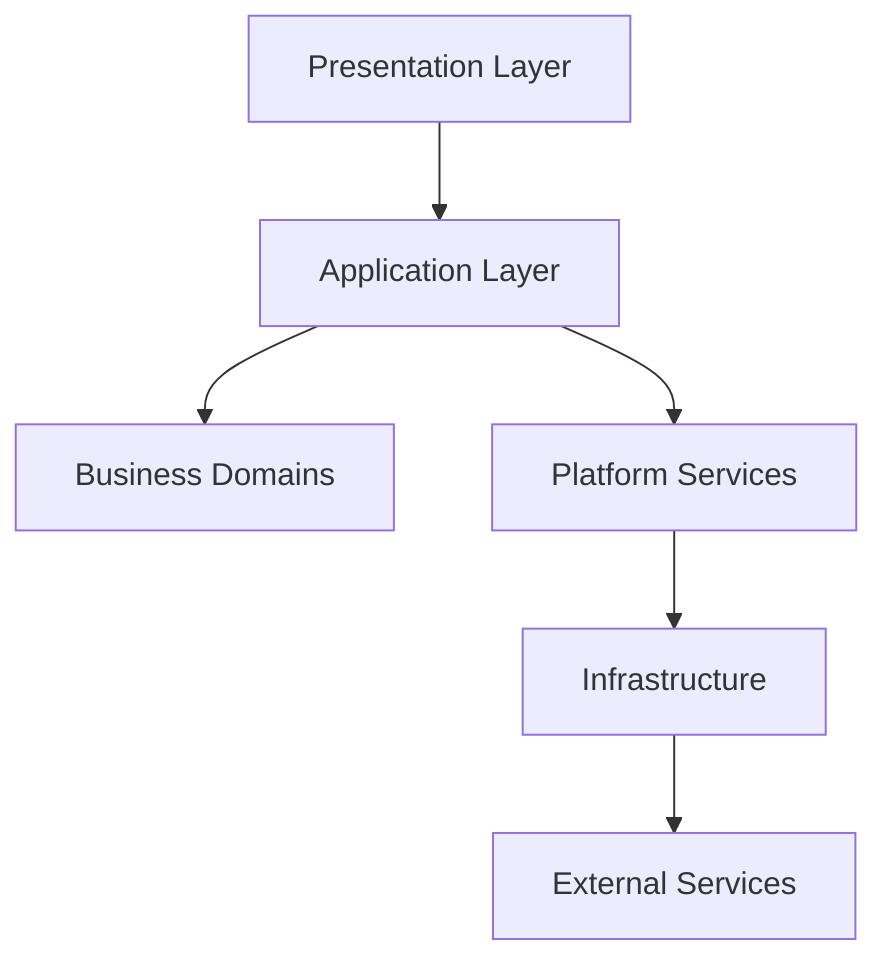

| Layer | Responsibility |
|--------|----------------|
| Presentation | User Experience |
| Application | Use Cases |
| Domain | Business Rules |
| Platform | AI Execution |
| Infrastructure | Technical Services |
| External | Third-party Integrations |

---

# 6. C4 - System Context

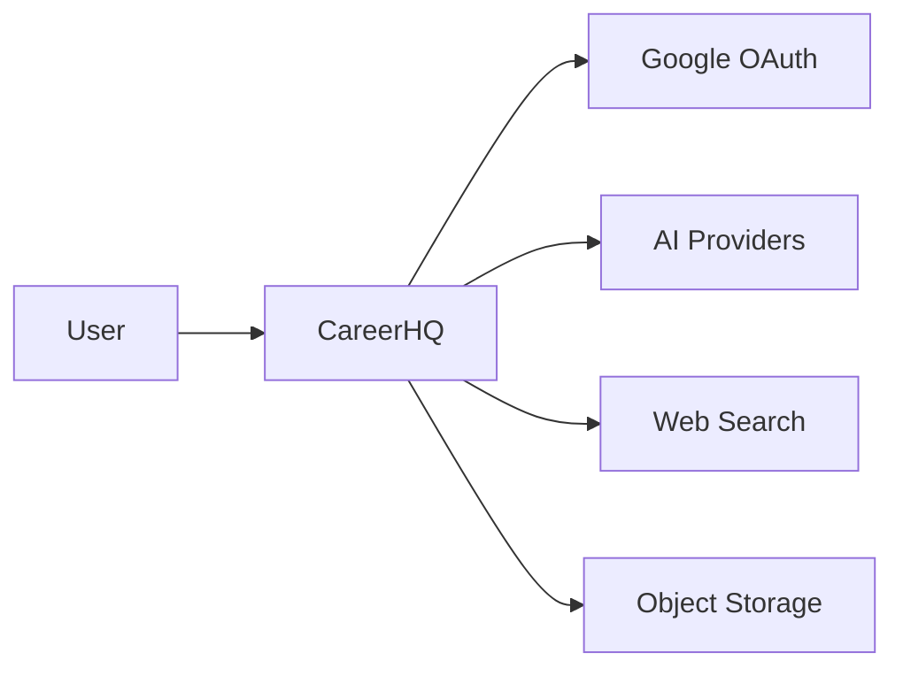

---

# 7. C4 - Container Diagram

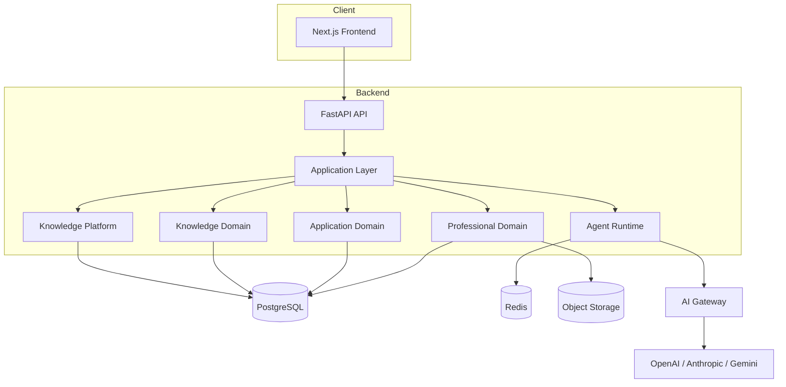

---

# 8. Layered Architecture

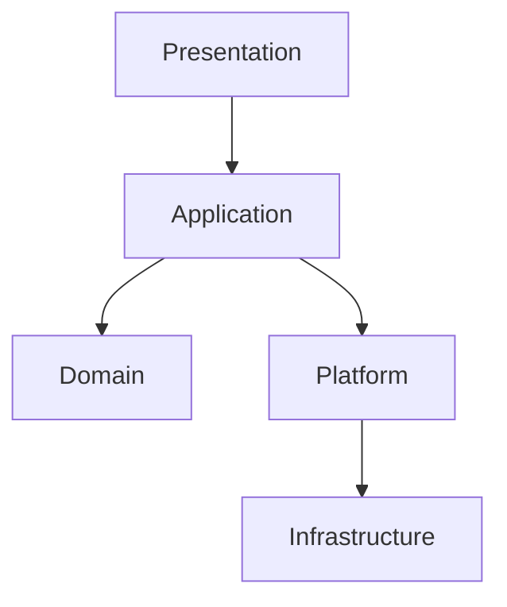

## Presentation Layer

Responsibilities:

- User Interface
- Authentication
- Forms
- Dashboard
- Resume Editor

---

## Application Layer

Responsibilities:

- Execute Use Cases
- Coordinate Domains
- Invoke Platform Services
- Handle Transactions
- Manage Approval Flow

---

## Domain Layer

Responsibilities:

- Business Rules
- Validation
- Aggregate Management
- Repository Coordination

Domains:

- Professional
- Application
- Knowledge

---

## Platform Layer

Responsibilities:

- AI Execution
- Knowledge Retrieval

Contains:

- Agent Runtime
- Knowledge Platform

---

## Infrastructure

Responsibilities:

- Database
- Redis
- Storage
- Workers
- Logging
- Configuration

# 9. Backend Component Architecture

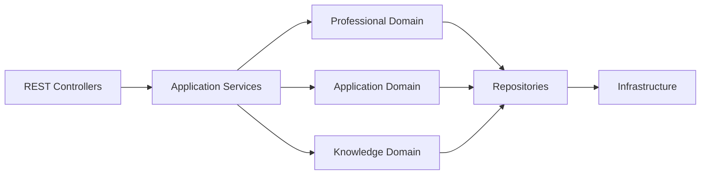

## Purpose

The backend follows Clean Architecture principles.

Each layer has a single responsibility.

Business rules are isolated from infrastructure and AI execution.

---

## Responsibilities

### REST Controllers

- Validate HTTP requests
- Authenticate users
- Convert DTOs
- Return HTTP responses

Controllers never contain business logic.

---

### Application Services

Responsible for orchestrating business use cases.

Examples:

- Tailor Resume
- Submit Application
- Research Company
- Prepare Interview

Application Services coordinate domains and platform services.

---

### Business Domains

Business Domains enforce deterministic rules.

Current domains:

- Professional Domain
- Application Domain
- Knowledge Domain

Business Domains never call AI providers.

---

### Repositories

Repositories abstract persistence.

Responsibilities:

- Load Aggregates
- Save Aggregates
- Query Read Models

Repositories never contain business logic.

---

# 10. Agent Runtime

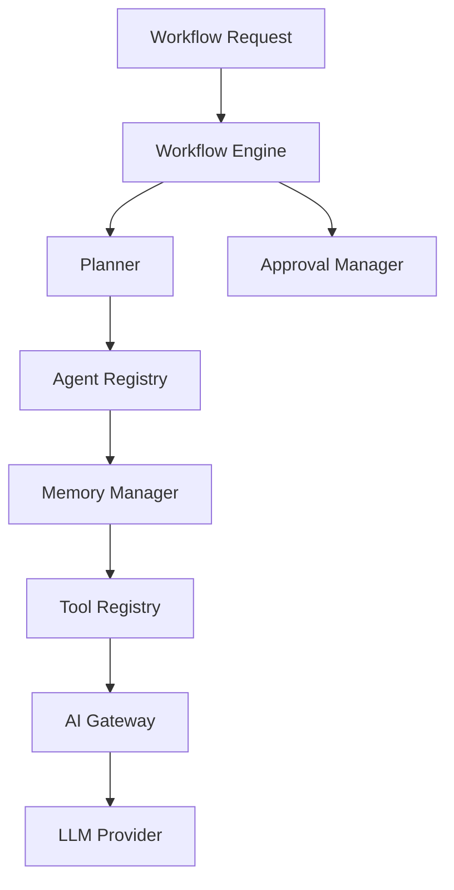

## Purpose

The Agent Runtime is responsible for executing every intelligent workflow inside CareerHQ.

It provides AI capabilities without owning business entities.

Business Domains remain deterministic.

---

## Responsibilities

- Execute workflows
- Coordinate agents
- Manage workflow state
- Invoke tools
- Retrieve knowledge
- Route AI requests
- Pause for approval
- Resume execution
- Record execution metadata

---

## Runtime Boundaries

The Agent Runtime **owns**:

- Workflow execution
- Planning
- Tool invocation
- AI communication
- Temporary memory

The Agent Runtime **does not own**:

- Professional Profiles
- Applications
- Resume Versions
- Company Research
- Business validation

---

# 11. Workflow Engine

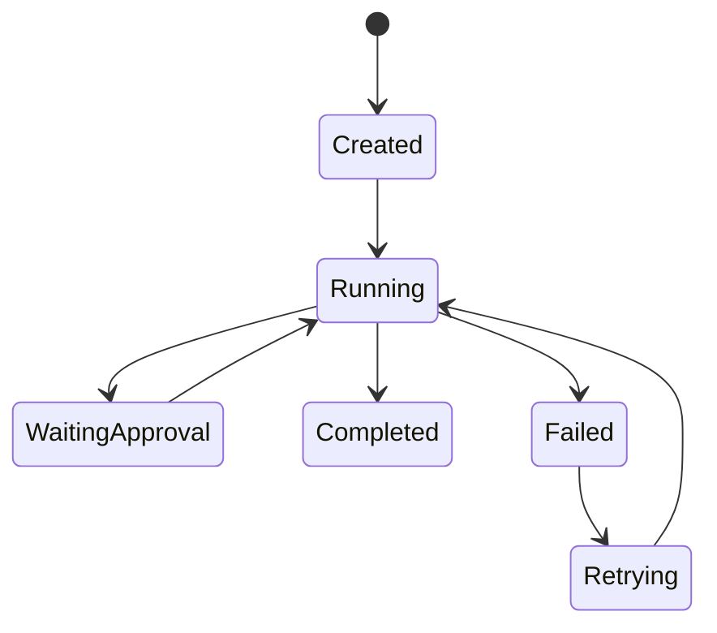

## Responsibilities

- Start workflows
- Execute workflow graph
- Persist execution state
- Retry failed steps
- Resume paused execution
- Publish workflow events

The Workflow Engine is independent of any specific orchestration framework.

Current implementation:

- LangGraph

---

# 12. Planner

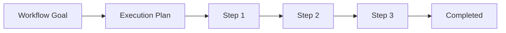

## Purpose

The Planner converts business goals into executable workflow steps.

Current implementation:

Deterministic planning.

Future implementation:

Dynamic planning based on workflow context.

---

## Example

Resume Tailoring

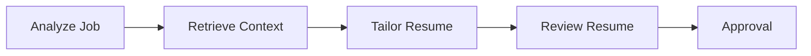

---

# 13. Agent Registry

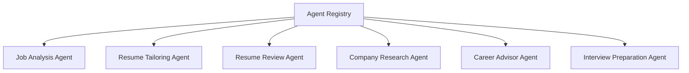

## Purpose

The Agent Registry maintains all available AI agents.

Agents are stateless execution units.

Each agent declares:

- Input Schema
- Output Schema
- Supported Models
- Required Tools
- Configuration

---

# 14. Tool Registry

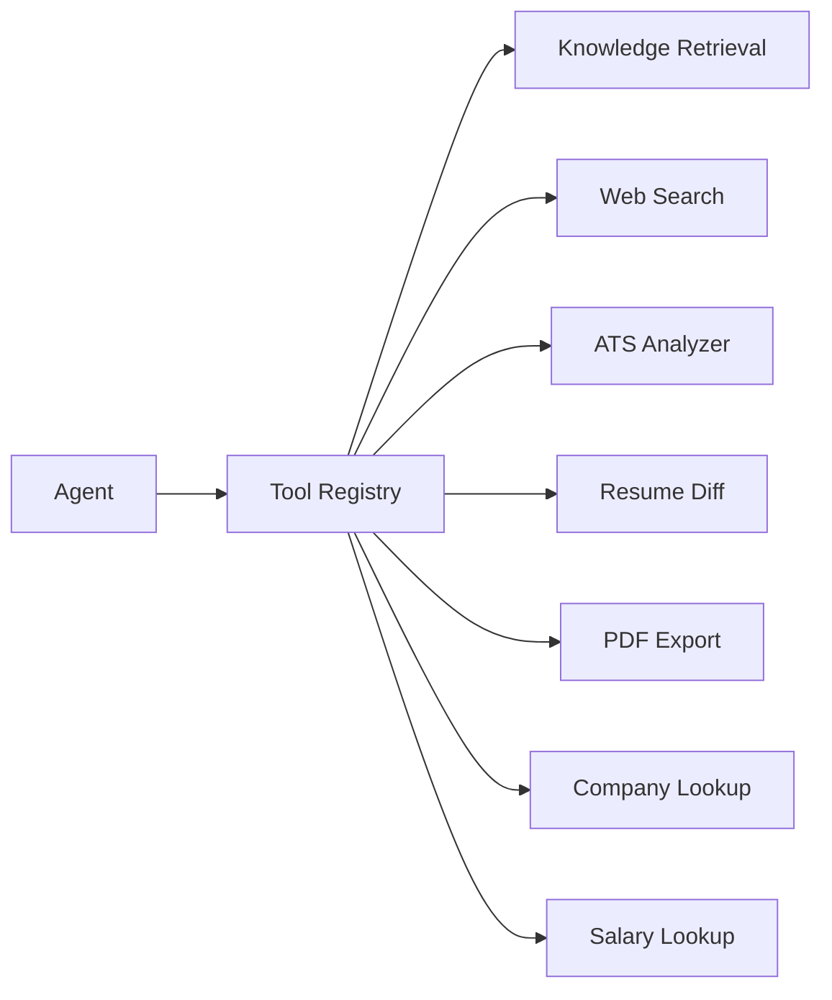

## Purpose

The Tool Registry exposes reusable capabilities.

Agents invoke tools through a common interface.

Tools may interact with:

- Knowledge Platform
- Infrastructure
- External Providers

Agents never communicate directly with external systems.

---

# 15. AI Gateway

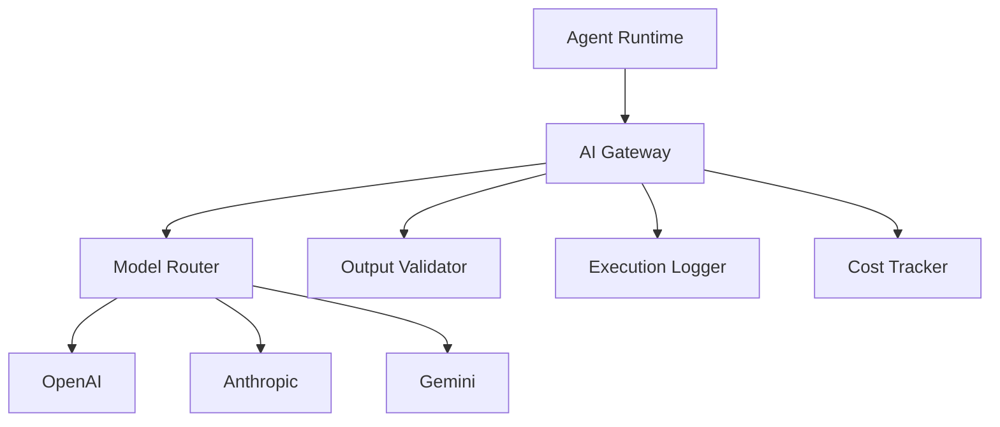

## Purpose

The AI Gateway provides a single integration point for all language models.

Business code remains completely independent from AI providers.

---

## Responsibilities

- Provider Routing
- Model Selection
- Retry Strategy
- Rate Limiting
- Cost Tracking
- Structured Output Validation
- Request Logging
- Response Normalization

---

## Design Decisions

- Business logic never communicates directly with model providers.
- Model providers are replaceable.
- Every AI response is validated before returning to the Agent Runtime.
- All AI requests are observable and auditable.

---
---

# 16. Knowledge Platform

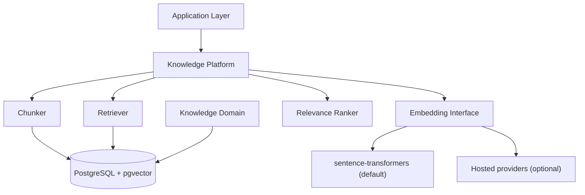

## Purpose

The Knowledge Platform turns owned data into retrievable context.

It exists so that generation is grounded in what the user has actually done,
rather than in what a model can plausibly invent — the Knowledge Before
Generation principle in section 4.

It is a **capability, not an owner**. Every fact it retrieves belongs to a
business domain; the platform holds derived vectors and nothing authoritative.
Deleting every embedding must cost nothing but recomputation (Principle V).

---

## Responsibilities

- Chunking
- Embedding Generation
- Vector Storage
- Semantic Retrieval
- Relevance Ranking
- Context Assembly

---

## Design Decisions

- **Vectors live in PostgreSQL via pgvector.** A separate vector database would
  add an operational component and a consistency problem — embeddings drifting
  out of step with the rows they describe — in exchange for scale this project
  will not reach.
- **The embedding interface is ours, not the gateway's.** LiteLLM fronts
  generation; embeddings are a separate seam because the primary provider
  (Anthropic) offers no embeddings endpoint. The default is a local
  sentence-transformers model, so the stack runs before any API key exists
  (doc 06, Embedding Models).
- **Retrieval returns citations, not just text.** Principle III requires the
  system to show where a claim came from, and that is only possible if the
  retriever preserves provenance through ranking.
- **Derived data is disposable.** Embeddings are rebuilt from source records;
  they are never the only copy of anything.

**Status**: designed, not built. Arrives with slice 004, where RAG first has a
consumer.

---

# 17. Deployment Architecture

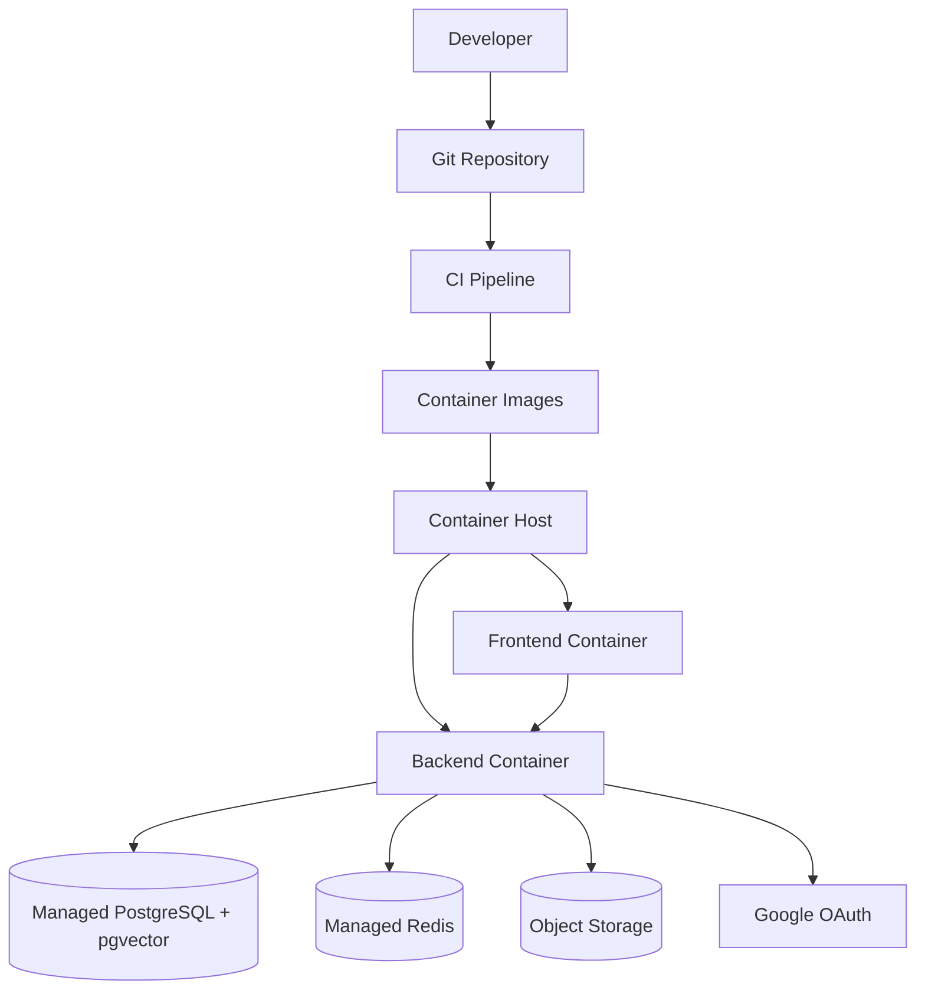

## Purpose

The deployed environment runs **the same container images** as local
development. Compose builds them; the host runs them. Nothing is rebuilt
differently for production, because a build that only happens in production is
a build nobody has tested.

---

## Responsibilities

- Image Build and Publication
- Configuration and Secret Injection
- Database Provisioning and Migration
- TLS Termination
- Automatic Redeployment on Merge

---

## Design Decisions

- **Managed data services, self-hosted application containers.** Postgres and
  Redis are the components where operational mistakes cost real data; the
  application containers are stateless and cheap to replace.
- **Configuration is environment, never image.** The same image runs locally and
  deployed. Anything that differs between them is injected — which is what makes
  `PUBLIC_BASE_URL` a variable rather than a constant.
- **`PUBLIC_BASE_URL` drives every browser-facing URL.** Behind a proxy the
  request's own host is the internal service name, so OAuth redirect URIs must
  come from configuration. This is the single most likely deployment failure and
  it is a configuration error, not a code change.
- **Migrations run before the new image serves traffic**, so the schema is never
  behind the code that reads it.
- **Redeployment is automatic on merge to main**, so the deployed environment is
  never a stale branch.

**Status**: designed, not built. Slice 002 — deliberately early, so OAuth
redirect URIs, managed Postgres, and HTTPS fail while the application is still
small enough to debug them in isolation (doc 05 §5.2). The hosting provider is
an open decision and gets an ADR when slice 002 starts.

---

# 18. Security Architecture

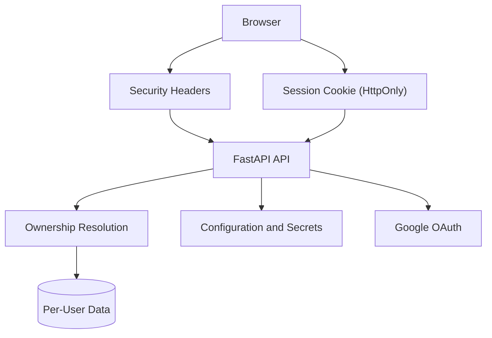

## Purpose

CareerHQ holds career history — employment dates, salaries, rejections. The
threat that matters is not a sophisticated attacker; it is one user seeing
another user's data, or a secret escaping into a log.

---

## Responsibilities

- Authentication
- Session Management
- Ownership Enforcement
- Secret Handling
- Response Hardening

---

## Design Decisions

- **Identity is delegated to Google.** No password is stored, so no password can
  be leaked. Authlib's `state` parameter, carried in a signed cookie, ties the
  callback to the browser that began the flow.
- **The session is a signed JWT in an `HttpOnly`, `SameSite=Lax` cookie.**
  `HttpOnly` means an XSS bug cannot exfiltrate the session; `SameSite=Lax`
  blocks cross-site POSTs while still permitting the top-level redirect back
  from Google. `Secure` is set outside local, where HTTPS exists.
- **Ownership comes from the session, never from the request.** No endpoint
  accepts a client-supplied user or profile id. A test enumerates every route
  and asserts that non-public ones return 401 — enumeration rather than a
  sample, because the route that gets forgotten is the one nobody listed.
- **Business invariants live in the schema.** A UNIQUE constraint cannot be
  raced or forgotten; an application-level check can be both.
- **Failure messages name the field, never the value.** A rejected secret is
  reported by field and error type, because the startup crash that protects a
  weak `SESSION_SECRET` must not print it (T068).
- **Unauthenticated endpoints disclose the kind of failure, not the detail.**
  Readiness reports `OperationalError`, not the driver's text naming the
  internal host, port, and database user. The detail goes to the log.
- **Every response carries `nosniff`, `DENY`, and `no-referrer`.** HSTS is added
  only in production, because pinning HTTPS from a plain-HTTP localhost is a
  pin the browser will cache and honour.

**Status**: built and verified in slice 001.

---

# 19. Observability

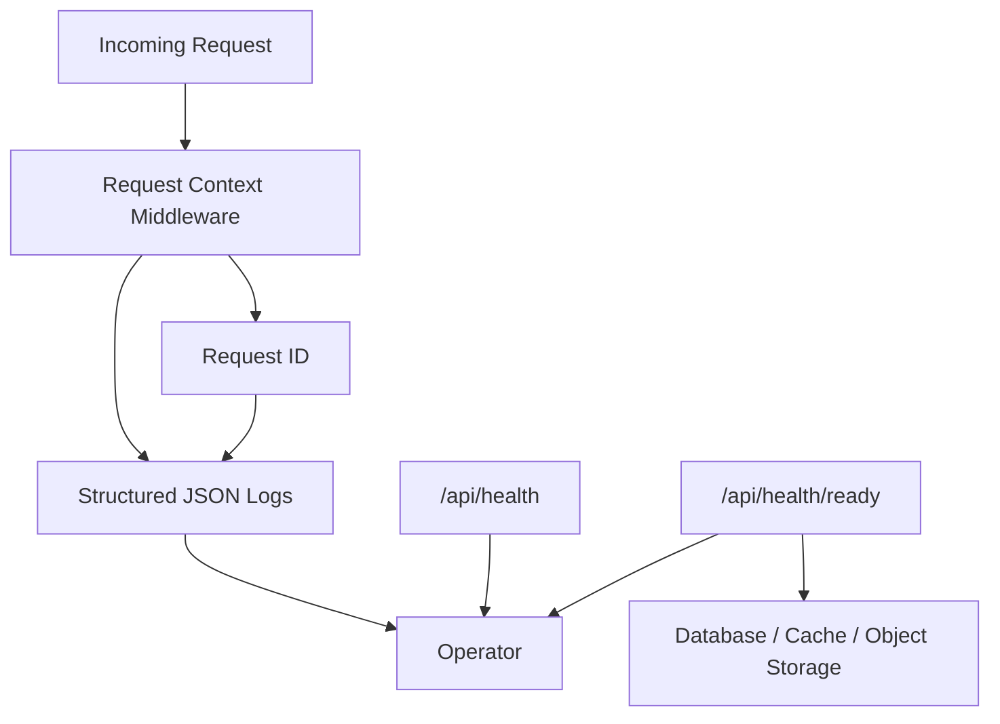

## Purpose

The question observability has to answer is "what is broken, right now, and
which request did it?" — answerable from the system's own output, without
reproducing the problem.

---

## Responsibilities

- Request Correlation
- Structured Logging
- Liveness Reporting
- Dependency Readiness Reporting
- AI Execution Logging

---

## Design Decisions

- **One JSON object per line, always.** Uvicorn's own handlers are removed and
  its records propagate to ours, so every line in the container is parseable —
  a log that is structured only most of the time cannot be queried.
- **Every line carries a request id**, taken from an inbound `X-Request-ID` when
  present so a proxy can correlate across services, and generated otherwise. It
  is echoed on the response, which is what lets a user's bug report name the
  exact request.
- **Liveness and readiness are separate endpoints.** Liveness touches nothing,
  so a slow dependency cannot make the container look dead and trigger a restart
  loop. Readiness probes every dependency **concurrently** and names each one,
  so an outage is diagnosable from the response alone.
- **A probe that has not answered in two seconds is reported as failed.** A
  health check that never returns is worse than one that returns bad news.
- **AI execution is logged at the gateway** (section 15), so cost and prompt
  history are observable without business code participating.

**Status**: request correlation, structured logging, and both health endpoints
are built and verified in slice 001. AI execution logging arrives with the
gateway in slice 004.
