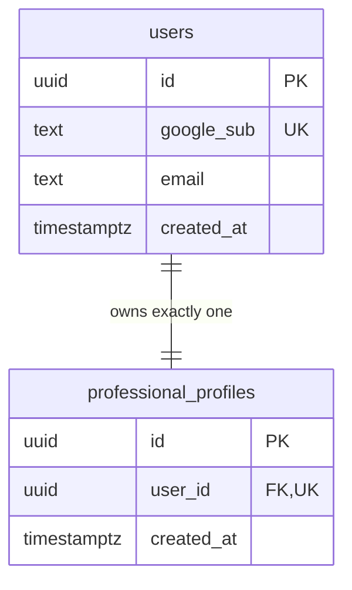

# Phase 1 Data Model: Platform Foundation

**Date**: 2026-08-05 | **Feature**: [spec.md](./spec.md)

Only the two tables this slice needs. Later slices add their own; the domain model in
[docs/03_Domain_Model.md](../../docs/03_Domain_Model.md) is the target shape.

---

## `users`

The account created on first Google sign-in.

| Column | Type | Constraints | Notes |
|---|---|---|---|
| `id` | UUID | PK, default `gen_random_uuid()` | UUIDs so IDs are not guessable or enumerable |
| `google_sub` | text | **UNIQUE**, NOT NULL | Google's stable subject claim — the identity key |
| `email` | text | NOT NULL | From the verified `email` claim |
| `display_name` | text | NULL | From the `name` claim; absent for some accounts |
| `avatar_url` | text | NULL | From the `picture` claim |
| `created_at` | timestamptz | NOT NULL, default `now()` | |
| `last_login_at` | timestamptz | NOT NULL, default `now()` | Updated on every sign-in |

**Rules**
- `google_sub`, not `email`, is the identity key: a Google account can change its email address,
  and matching on email would let an address change split one person into two accounts.
- The UNIQUE constraint on `google_sub` is what makes concurrent first sign-in safe (R-004).

---

## `professional_profiles`

The empty container created alongside the user. Holds no content this slice.

| Column | Type | Constraints | Notes |
|---|---|---|---|
| `id` | UUID | PK, default `gen_random_uuid()` | |
| `user_id` | UUID | **UNIQUE**, NOT NULL, FK → `users.id` ON DELETE CASCADE | UNIQUE is the one-profile-per-user invariant |
| `created_at` | timestamptz | NOT NULL, default `now()` | |
| `updated_at` | timestamptz | NOT NULL, default `now()` | |

**Rules**
- UNIQUE on `user_id` enforces Constitution Principle I in the schema rather than in application
  code, so no code path can violate it.
- Created in the same transaction as the user. A user without a profile is not a reachable state.

---

## Session (not persisted)

A signed JWT in an HttpOnly cookie — there is no session table.

| Claim | Meaning |
|---|---|
| `sub` | `users.id` |
| `exp` | Issued-at + 7 days (configurable) |
| `iat` | Issue time |

**Cookie**: `careerhq_session`, `HttpOnly`, `SameSite=Lax`, `Path=/`, `Secure` when not local,
`Max-Age` matching `exp`.

**Rules**
- Every query for user-owned data filters on `sub`. Ownership is derived from the session, never
  from a client-supplied ID (FR-015).
- A token whose signature fails, whose `exp` has passed, or whose `sub` no longer exists is
  treated as unauthenticated — never as an error page (edge case: "Session no longer valid").

---

## Entity relationship

---

## Migration notes

Migration `0001_foundation`:
1. `CREATE EXTENSION IF NOT EXISTS vector` — enabled now so later knowledge features need no
   environment change (FR-004).
2. `CREATE EXTENSION IF NOT EXISTS pgcrypto` — for `gen_random_uuid()` on Postgres versions where
   it isn't built in.
3. Create `users`, then `professional_profiles` (FK order matters).
4. Both UNIQUE constraints are created with the tables, not added later — they are correctness
   constraints, and a window without them is a window where bad rows can land.
